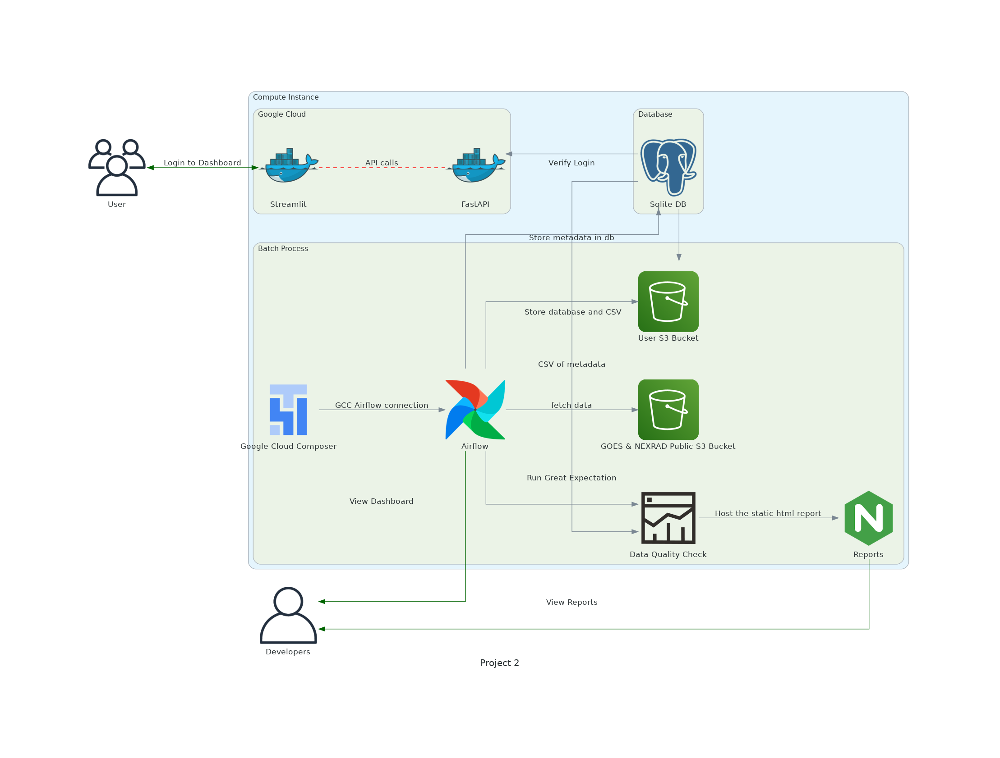

# Assignment_02

**Codelab Link:** https://codelabs-preview.appspot.com/?file_id=1mYE7swaLKECj7j_yHg2l7awS30_TEiA891EELlxv6H8#0  

**Streamlit link:** 

The goal of this assignment was to create a platform to retrieve GOES18 and Nexrad data from NOAA AWS S3 buckets, and then enable the user to be able to choose files based on features like Station, Year, Date and hour.

Functionalities included - 

- User Authentication
- Automated data retrieval through Airflow, GCC on Google cloud platform
- FASTAPI deployment & Dockerizations (Backend + Frontend)
- Great Expectations data validation
- Pytest - unit testing for each use case

#### Architecture Diagram

#### Steps to run the project

1. Clone the repository
2. Install the requirements using `pip install -r requirements.txt`
3. Run the streamlit app using `streamlit run app.py`
4. Run the uvicorn server using `uvicorn main:app --reload`

#### Attestation
WE ATTEST THAT WE HAVEN’T USED ANY OTHER STUDENTS WORK IN OUR ASSIGNMENT AND ABIDE BY THE POLICIES LISTED IN THE STUDENT HANDBOOK

Contribution:
- Dhanush Kumar Shankar: 25%
- Nishanth Prasath: 25%
- Shubham Goyal: 25%
- Subhash Chandran Shankarakumar: 25%
